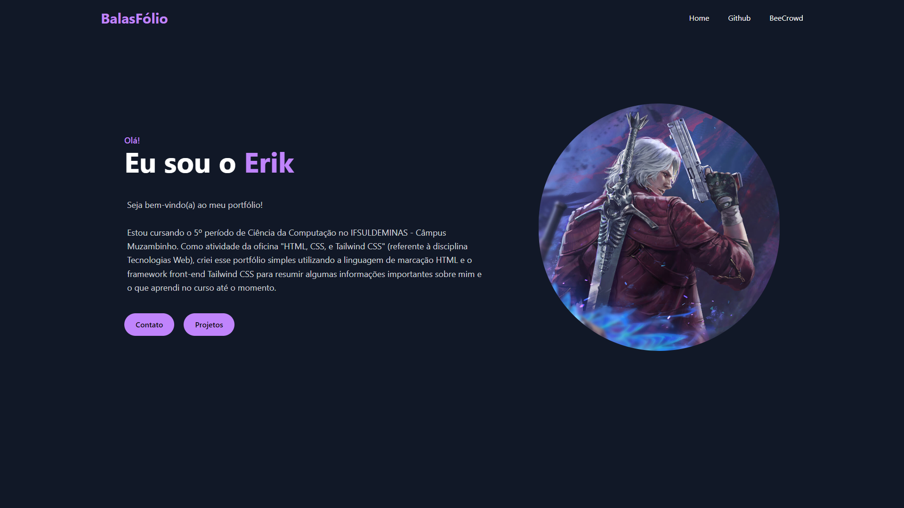

# Portfólio HTML + Tailwind CSS

Atividade referente à oficina de **HTML**, **CSS** e **Tailwind CSS** ministrada nos dias 20/03, 21/03 e 27/03 como parte da disciplina **Tecnologias Web**. Trata-se de um portfólio simples utilizando os conceitos e funcionalidades apresentadas durante a oficina, o qual resume informações básicas sobre mim e meus projetos.

**Preview:**

---

**Curso:** Ciência da Computação  
**Disciplina:** Tecnologias Web  
**Docente:** Gustavo José  
